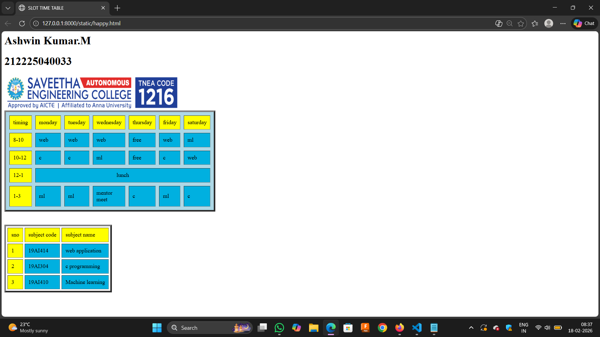

# Ex02 Time Table
## Date:07/02/2026

## AIM
To write a html webpage page to display your slot timetable.

## ALGORITHM
### STEP 1
Create a Django-admin Interface.

### STEP 2
Create an App inside the Django project.

### STEP 2
Create a static folder uder the created App and insert HTML code.

### STEP 3
Create a simple table using ```<table>``` tag in html with the relevant attributes.

### STEP 4
Add rows using ```<tr>``` tag.

### STEP 5
Add your course schedule using ```<td>``` tag.

### STEP 6
Execute the program using runserver command.

## PROGRAM
```
    <html>
        <title>SLOT TIME TABLE</title>
        <body>
            
                

            <table bgcolor="lightblue" border ="5" cellpadding="10" cellspacing="10"  width="40">
                <tr>
                    <td bgcolor="yellow">timing</td>
                    <td bgcolor="yellow">monday</td>
                    <td bgcolor="yellow">tuesday</td>
                    <td bgcolor="yellow">wednesday</td>
                    <td bgcolor="yellow">thursday</td>
                    <td bgcolor="yellow">friday</td>
                    <td bgcolor="yellow">saturday</td>
                </tr>

                <tr bgcolor="sky blue">
                    <td bgcolor="yellow">8-10</td>
                    <td>web</td>
                    <td>web</td>
                    <td>web</td>
                    <td>free</td>
                    <td>web</td>
                    <td>ml</td>
                </tr>

                <tr bgcolor="sky blue ">
                    <td bgcolor="yellow">10-12</td>
                    <td>c</td>
                    <td>c</td>
                    <td>ml</td>
                    <td>free</td>
                    <td>c</td>
                    <td>web</td>
                </tr>

                <tr bgcolor="sky blue">
                    <td  bgcolor="yellow">12-1</td>
                    <td colspan="6" align="center"> lunch</td>
                </tr>

                <tr>
                    <td  bgcolor="yellow">1-3</td>
                    <td bgcolor="sky blue">ml</td>
                    <td bgcolor="sky blue">ml</td>
                    <td bgcolor="sky blue">mentor meet</td>
                    <td bgcolor="sky blue">c</td>
                    <td bgcolor="sky blue">ml</td>
                    <td bgcolor="sky blue"   >c</td>
                </tr>
                </table>
                <br>
                <br>

                <table border="5" cellpadding="10" cellspacing="5">

                <tr bgcolor="yellow">
                    <td>sno</td>
                    <td> subject code</td>
                    <td> subject name </td>
                </tr>
                
                <tr>
                    <td bgcolor="yellow">1</td>
                    <td bgcolor="sky blue">19AI414</td>
                    <td bgcolor="sky blue">web application</td>
                    
                </tr>
                <tr>
                    <td bgcolor="yellow">2</td>
                    <td bgcolor="sky blue">19AI304</td>
                    <td bgcolor="sky blue">c programming</td>
                </tr>
                <tr>
                    <td bgcolor="yellow">3</td>
                    <td bgcolor="sky blue">19AI410</td>
                    <td bgcolor="sky blue">Machine learning</td>
                </tr>
                </table>
        </body>
    </html>

```


## OUTPUT


## RESULT
The program for creating slot timetable using basic HTML tags is executed successfully.
